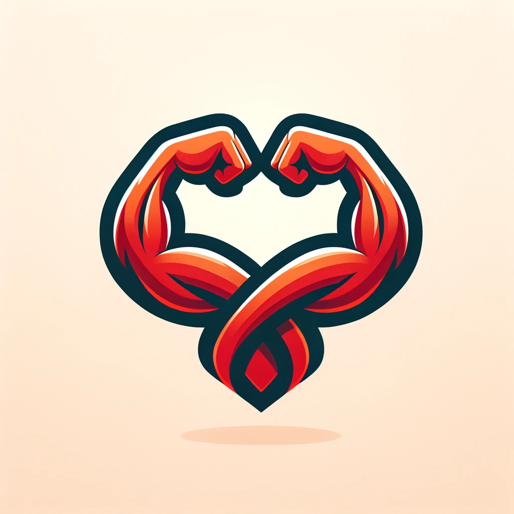

 <!-- Improved compatibility of back to top link: See: https://github.com/othneildrew/Best-README-Template/pull/73 -->

<!--
*** Thanks for checking out the Best-README-Template. If you have a suggestion
*** that would make this better, please fork the repo and create a pull request
*** or simply open an issue with the tag "enhancement".
*** Don't forget to give the project a star!
*** Thanks again! Now go create something AMAZING! :D
-->

<!-- PROJECT SHIELDS -->
<!--
*** I'm using markdown "reference style" links for readability.
*** Reference links are enclosed in brackets [ ] instead of parentheses ( ).
*** See the bottom of this document for the declaration of the reference variables
*** for contributors-url, forks-url, etc. This is an optional, concise syntax you may use.
*** https://www.markdownguide.org/basic-syntax/#reference-style-links
-->

<!-- PROJECT LOGO -->
 

  

  <h1 align="center">GymConnect</h3>

  

    Connect with Fellow Gym Bros!
     
  

<!-- ABOUT THE PROJECT -->

## About The Project

The GymConnect project endeavors to bridge the gap in the fitness world by addressing several pressing issues. Many people find it challenging to meet like-minded fitness enthusiasts at the gym, maintain organized workout routines, and build a sense of community within their fitness journey. In response to these challenges, we propose the development of a cutting-edge mobile application, GymConnect. This innovative app will serve as an all-encompassing fitness companion, offering a multitude of features designed to empower users and create a supportive community. With GymConnect, users can easily discover workout partners who share their fitness interests, log and track their workouts, access expert guidance and information on exercises, and interact within fitness-focused communities. By setting and achieving fitness goals, users will not only improve their physical well-being but also find motivation and recognition within GymConnect's vibrant fitness community. The GymConnect project aims to redefine the gym experience, making it more engaging, connected, and ultimately, more effective for fitness enthusiasts of all levels.

### Built With

This project was built with React Native for frontend as allows us to use the same codebase to build apps for both iOS and Android. For backend, we use Python (Flask framework). This is lightweight, easy to build, test and deploy. For a database, we use supabase (PostgreSQL). Relational database makes sense for this project as users will be connected to each other (social media aspect) and data will be fairly structured.

- [![React Native][React-Native]][React-Native-url]
- [![Flask][Flask]][Flask-url]
- [![Supabase][Supabase]][Supabase-url]

<!-- GETTING STARTED -->

## Getting Started

See READMEs in respective backend and frontend directories for instructions to start each.

<!-- CONTACT -->

## Contact
Darren Shih - dshih5@jhu.edu

Fabrice Ingabire - fingabi1@jhu.edu

Ishan Hemmige - ihemmig1@jhu.edu

Kiron Deb - kdeb1@jhu.edu

Peter Goh - pgoh4@jhu.edu

Sambhav Chordia - schordi1@jhu.edu

<!--Your Name - [@your_twitter](https://twitter.com/your_username) - email@example.com-->

Project Link: [https://github.com/jhu-oose-f23/team-Team99](https://github.com/jhu-oose-f23/team-Team99)

Latest Deployed Version:

<!-- MARKDOWN LINKS & IMAGES -->
<!-- https://www.markdownguide.org/basic-syntax/#reference-style-links -->

[contributors-shield]: https://img.shields.io/github/contributors/othneildrew/Best-README-Template.svg?style=for-the-badge
[contributors-url]: https://github.com/othneildrew/Best-README-Template/graphs/contributors
[forks-shield]: https://img.shields.io/github/forks/othneildrew/Best-README-Template.svg?style=for-the-badge
[forks-url]: https://github.com/othneildrew/Best-README-Template/network/members
[stars-shield]: https://img.shields.io/github/stars/othneildrew/Best-README-Template.svg?style=for-the-badge
[stars-url]: https://github.com/othneildrew/Best-README-Template/stargazers
[issues-shield]: https://img.shields.io/github/issues/othneildrew/Best-README-Template.svg?style=for-the-badge
[issues-url]: https://github.com/othneildrew/Best-README-Template/issues
[license-shield]: https://img.shields.io/github/license/othneildrew/Best-README-Template.svg?style=for-the-badge
[license-url]: https://github.com/othneildrew/Best-README-Template/blob/master/LICENSE.txt
[linkedin-shield]: https://img.shields.io/badge/-LinkedIn-black.svg?style=for-the-badge&logo=linkedin&colorB=555
[linkedin-url]: https://linkedin.com/in/othneildrew
[product-screenshot]: images/screenshot.png
[Next.js]: https://img.shields.io/badge/next.js-000000?style=for-the-badge&logo=nextdotjs&logoColor=white
[Next-url]: https://nextjs.org/
[React.js]: https://img.shields.io/badge/React-20232A?style=for-the-badge&logo=react&logoColor=61DAFB
[React-url]: https://reactjs.org/
[Vue.js]: https://img.shields.io/badge/Vue.js-35495E?style=for-the-badge&logo=vuedotjs&logoColor=4FC08D
[Vue-url]: https://vuejs.org/
[Angular.io]: https://img.shields.io/badge/Angular-DD0031?style=for-the-badge&logo=angular&logoColor=white
[Angular-url]: https://angular.io/
[Svelte.dev]: https://img.shields.io/badge/Svelte-4A4A55?style=for-the-badge&logo=svelte&logoColor=FF3E00
[Svelte-url]: https://svelte.dev/
[Laravel.com]: https://img.shields.io/badge/Laravel-FF2D20?style=for-the-badge&logo=laravel&logoColor=white
[Laravel-url]: https://laravel.com
[Bootstrap.com]: https://img.shields.io/badge/Bootstrap-563D7C?style=for-the-badge&logo=bootstrap&logoColor=white
[Bootstrap-url]: https://getbootstrap.com
[JQuery.com]: https://img.shields.io/badge/jQuery-0769AD?style=for-the-badge&logo=jquery&logoColor=white
[JQuery-url]: https://jquery.com
[React-Native-url]: https://reactnative.dev/
[React-Native]: https://img.shields.io/badge/react_native-%2320232a.svg?style=for-the-badge&logo=react&logoColor=%2361DAFB
[Flask-url]: https://flask.palletsprojects.com/en/2.3.x/
[Flask]: https://img.shields.io/badge/flask-%23000.svg?style=for-the-badge&logo=flask&logoColor=white
[Supabase-url]: https://supabase.com/
[Supabase]: https://img.shields.io/badge/Supabase-3ECF8E?style=for-the-badge&logo=supabase&logoColor=white

## Branching strategy

Follow these steps when you start working on a new feature / bugfix:

1. Checkout to the current iteration (iter-01 for iteration 1) and pull the latest changes
2. Checkout to your own feature branch (e.g. kiron/add-feature)
3. Commit changes
4. Go to https://github.com/jhu-oose-f23/team-Team99/pulls and make a pull request. Set the base branch to be the current iteration (e.g. iter-01) and the compare branch to your feature branch (e.g. kiron/add-feature)
5. Request a review from 1 or more teammates and wait for approval
6. Merge after receiving approval

At the end of an iteration, merge the iteration branch into main (e.g. iter-01 -> main)
